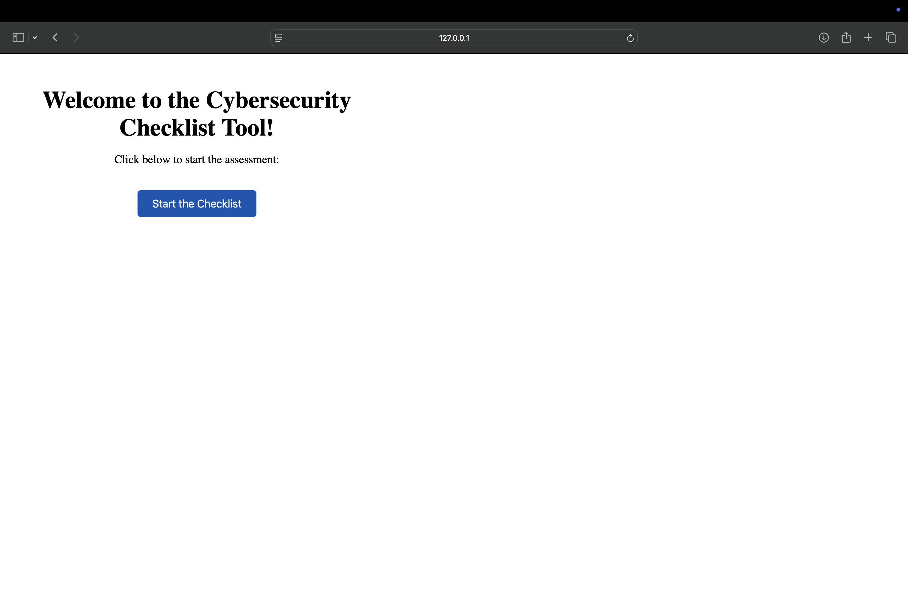
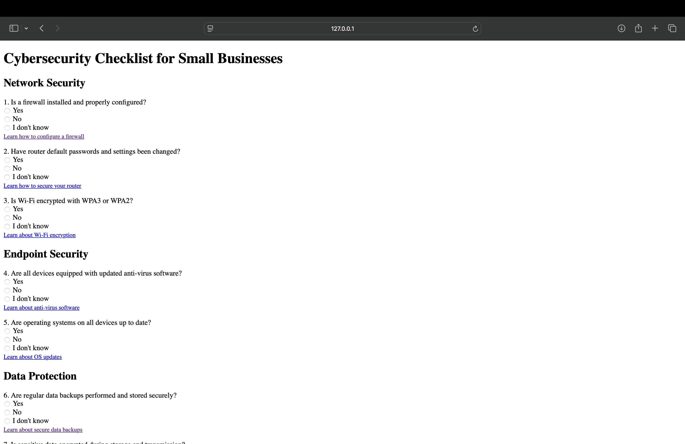
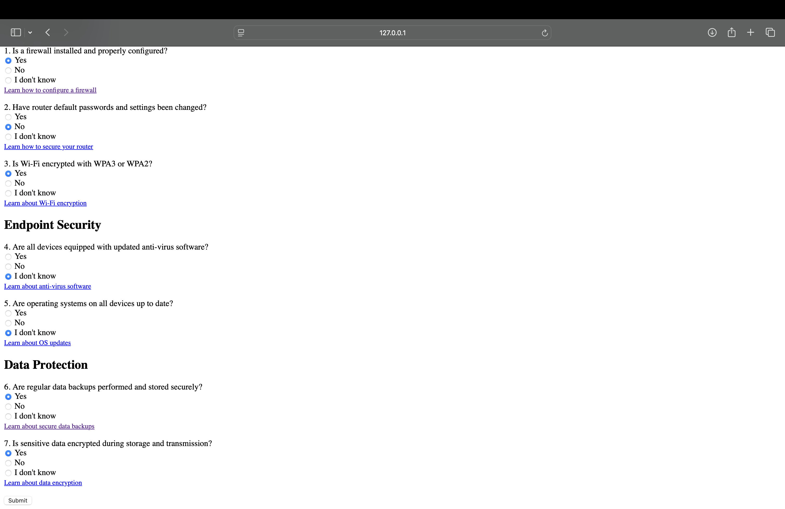
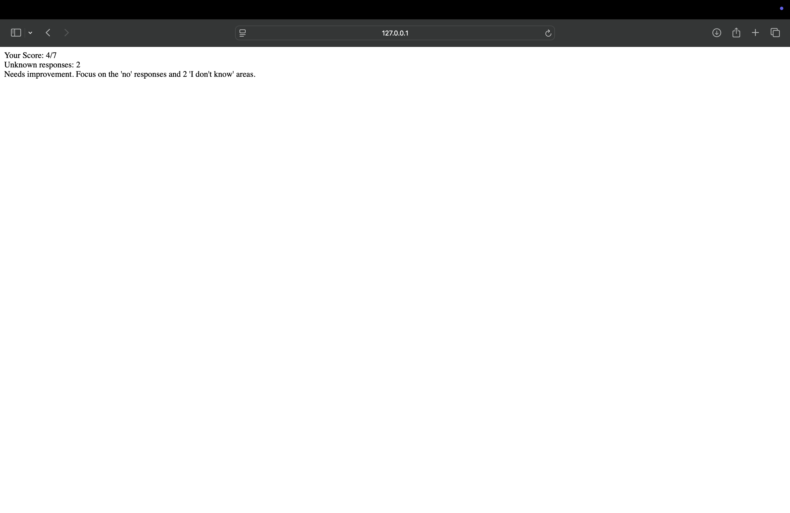
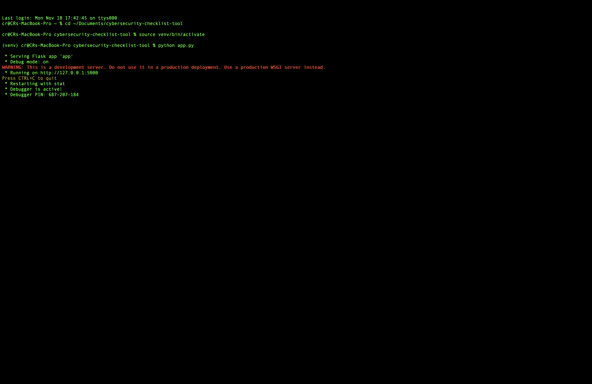

# Cybersecurity Checklist Tool

## Overview

The **Cybersecurity Checklist Tool** is a simple and effective web-based application designed to help small businesses evaluate their cybersecurity posture. Users can complete a checklist of best practices and receive a score summarizing their level of security readiness.

## Features

- **Interactive Checklist**: A comprehensive set of questions based on cybersecurity best practices.
- **Scoring System**: Immediate feedback with a calculated score to assess readiness.
- **User-Friendly Interface**: Clean and easy-to-navigate layout.
- **Results Summary**: Displays actionable results to improve cybersecurity posture.

## Setup Instructions

### Prerequisites
- Python 3.13 or later
- Virtual environment setup (recommended)
- Basic understanding of the command line

### Installation

1. **Clone the Repository**:
   ```bash
   git clone https://github.com/c-razo/cybersecurity-checklist-tool.git
   cd cybersecurity-checklist-tool
   ```

2. **Create and Activate a Virtual Environment**:
   ```bash
   python -m venv venv
   source venv/bin/activate  # For macOS/Linux
   venv\Scripts\activate     # For Windows
   ```

3. **Install Dependencies**:
   ```bash
   pip install -r requirements.txt
   ```

4. **Run the Application**:
   ```bash
   python app.py
   ```

5. **Access the Application**:
   - Open a browser and go to: [http://127.0.0.1:5000](http://127.0.0.1:5000)

## Usage

1. Navigate to the homepage.
2. Complete the checklist questions by selecting the appropriate options.
3. Submit the checklist to view your score and recommendations.
4. Use the provided feedback to enhance your cybersecurity practices.

## File Structure

```
cybersecurity-checklist-tool/
│
≈y├── app.py                   # Main application file
├── README.md                # Project documentation
├── requirements.txt         # Dependencies
├── templates/               # HTML templates
│   ├── index.html           # Home page
│   ├── checklist.html       # Checklist form
│   └── results.html         # Results page
├── static/                  # Static assets
│   ├── styles.css           # Styling for the application
│   └── results.txt          # Sample results file
├── venv/                    # Virtual environment folder
├── docs/                    # Documentation files
│   └── screenshots/         # Screenshots for the project
└── LICENSE                  # License file
```

## Screenshots

| Feature               | Screenshot                                   |
|------------------------|---------------------------------------------|
| **Homepage**           |          |
| **Checklist Form**     |         |
| **Sample Checklist**   |  |
| **Checklist Results**  |           |
| **Command Line Start** |      |

## Future Improvements

- Add a feature to generate a downloadable PDF report for the results.
- Implement user authentication to save checklist progress.
- Add advanced analytics and visualization for checklist results.
- Add unit tests for better code reliability.

## Contributing

Contributions are welcome! Please follow these steps:
1. Fork the repository.
2. Create a new branch for your feature or bugfix.
3. Commit your changes with a descriptive message.
4. Push the branch and create a pull request.

## License

This project is licensed under the [MIT License](LICENSE).

---
